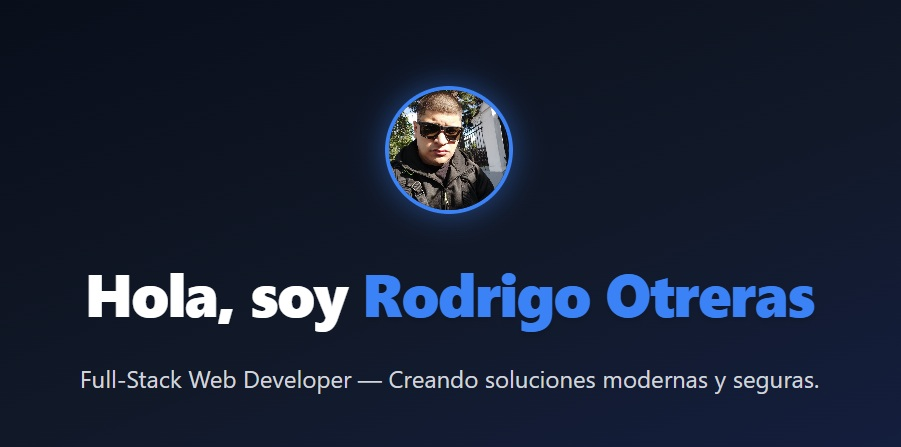

# Portafolio Profesional — Rodrigo Otreras



## 🖥️ Descripción

Portfolio personal desarrollado en **React** + **Tailwind CSS**, moderno y 100% responsivo. 
Presento mis proyectos, skills y contacto, con diseño cuidado, animaciones suaves y sección 
de contacto funcional.

---

## 🛠️ Tecnologías utilizadas

- [React](https://react.dev/)
- [React Router](https://reactrouter.com/)
- [Tailwind CSS](https://tailwindcss.com/)
- [Framer Motion](https://www.framer.com/motion/) (animaciones)
- [React Icons](https://react-icons.github.io/react-icons/)
- (Próximamente: Backend en Node.js o C#)

---

## 📁 Estructura de carpetas

src/
├── assets/ # Imágenes y recursos
├── components/ # Navbar, Footer, ProjectCard, etc.
├── data/ # Archivo de proyectos
├── pages/ # Home, About, Projects, Skills, Contact
├── App.jsx # Layout principal y rutas
├── index.css # Estilos generales
└── main.jsx # Entrada principal


---

## ⚡ Funcionalidades

- Navbar responsiva con menú hamburguesa animado
- Secciones: Inicio, Sobre mí, Proyectos, Skills, Contacto
- Cards animadas para proyectos y skills
- Formulario de contacto
- Animaciones suaves en todo el sitio
- Footer con redes sociales
- 100% mobile friendly

---

## 🖼️ Capturas de pantalla

(¡Pegá acá tus screenshots principales del sitio!)

---

## 📝 Instalación y uso local

1. **Clona el repositorio:**
   ```sh
   git clone https://github.com/XxTreendxX/portfolio.git
   cd portfolio

## 📬 Contacto

1. [LinkedIn] (https://www.linkedin.com/in/rodrigo-nahuel-otreras-703a741a1/)
2. [GitHub] (https://github.com/XxTreendxX)
3. Contactame desde el formulario del sitio.


## 💡 Autor
Rodrigo Nahuel Otreras